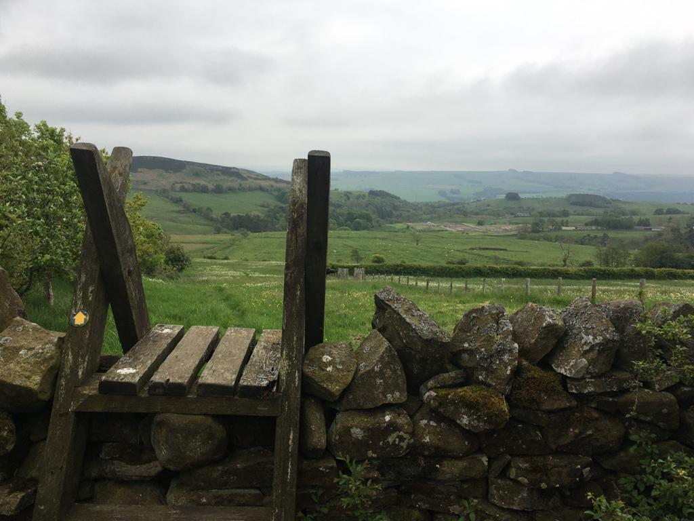
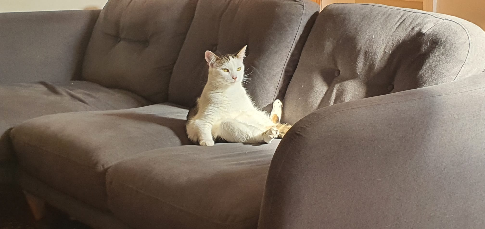

# manualof Andrew West
2021-07-14

I'm **Andrew** *(he/him)*.  Data Scientist HEO in DSMT, ELM, Defra.  Started March 2021, in DSET.  I work from home, **Leeds**.  I typically work **9:00-17:30**, but take advantage of flexitime for when I don't feel productive.  Easiest way to contact me is **Teams**, I like chat and calls.  PM to give me honest feedback, I'm trying to improve.

In DSMT I focus on the population simulation, GIS analysis, data access, software infrastructure (CDAP and SCE).  I like to work with Python if I get a choice, and a bit of a stickler for using git and linting.  I try to follow Uncle Bob's Clean Code mantra: ['The only way to go fast, is to go well!'](https://factorio.com/blog/post/fff-366).  I like to think; by working for Defra I am helping improve environmental policy and practice, even as a farming illiterate mathematician.

My [16 personalities](https://www.16personalities.com/) result is ISTP-A.  Which means... 🤷.  Maybe this implies reasons; why I'm never your first choice presenter, why I dive deep into rabbit holes learning programming, or why I avoid reading.  Or why I created [this](https://github.com/aw-west-defra/manuelof.me/blob/main/README.md) instead of working, or [Conscious Contours](https://consciouscontours.com/) while not working.

---

[manualof.me](https://www.manualof.me/)
